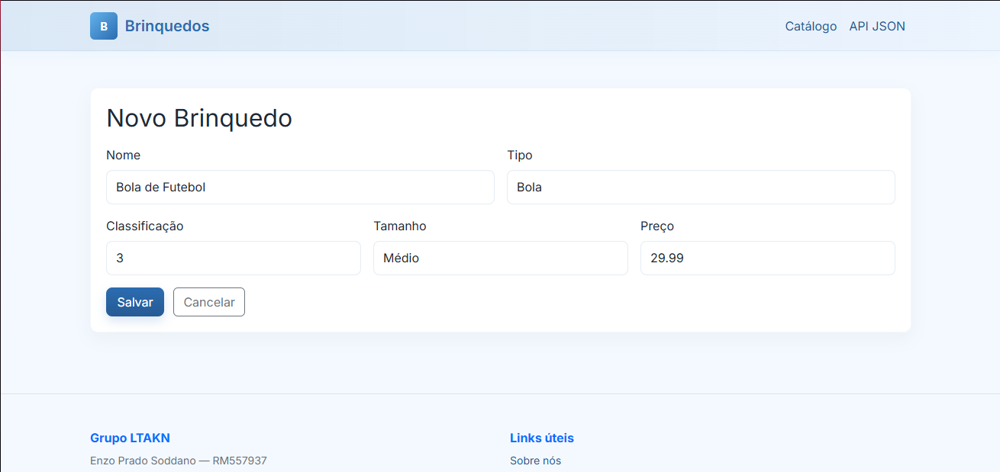
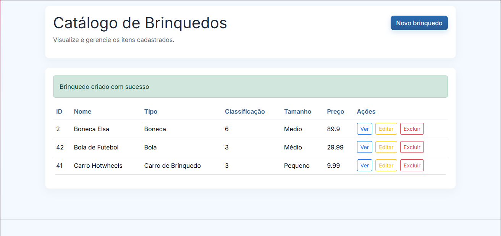
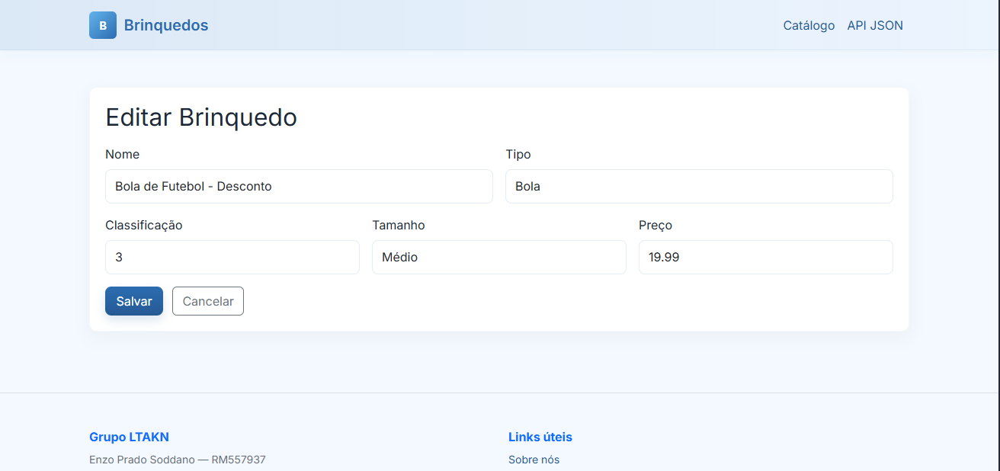
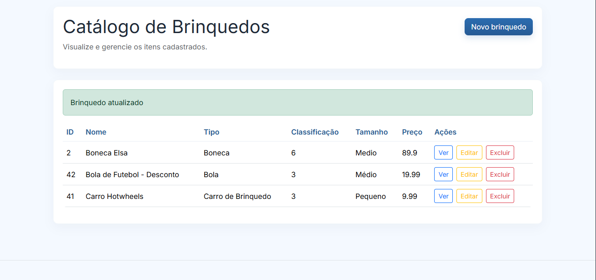
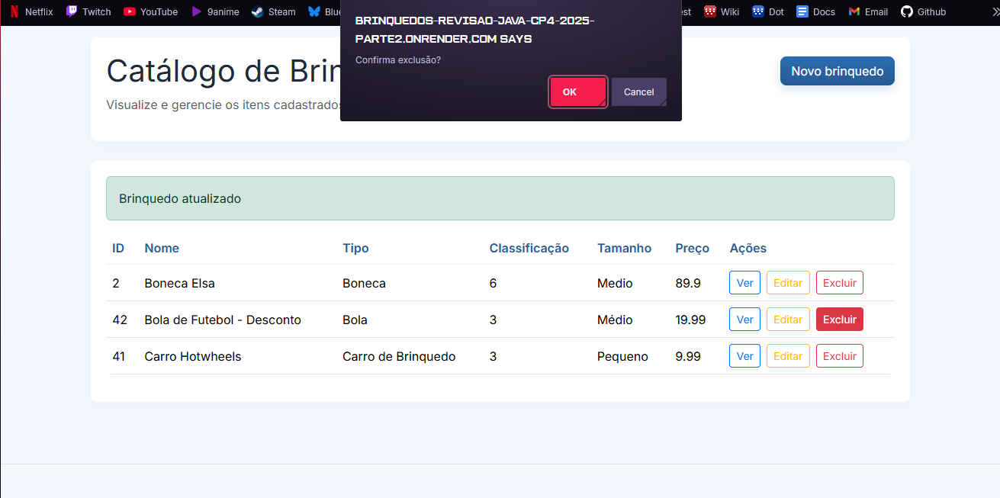
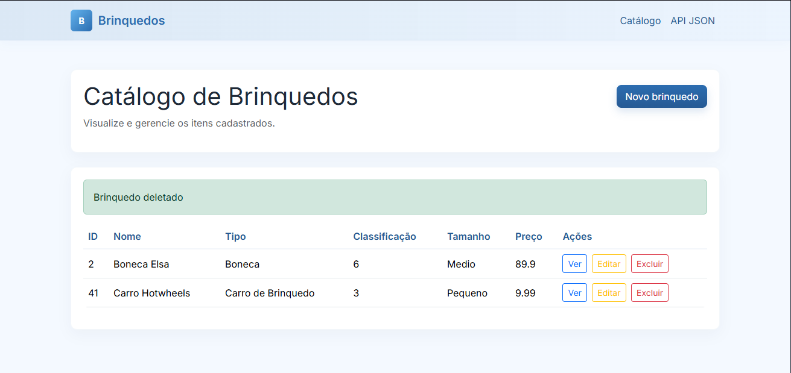

# Brinquedos - Checkpoint 4 (Parte 2)

**Grupo:** LTAKN  
- Enzo Prado Soddano — RM557937  
- Lucas Resende Lima — RM556564  
- Vinicius Prates Altafini — RM556183  

---

## 📌 Descrição
Este projeto é a **Parte 2** do Checkpoint 4 de Java Advanced.  
Na **Parte 1** implementamos uma API REST com Spring Boot e HATEOAS.  
Agora, na **Parte 2**, evoluímos a aplicação para incluir:

- Interface web usando **Spring MVC + Thymeleaf**  
- Estilização com Bootstrap + CSS customizado (tema azul/branco)  
- CRUD completo de brinquedos pela interface web  
- Footer institucional com dados do grupo  
- Deploy no Render com Dockerfile  

---

## 🚀 Deploy / Entrega

- 🌐 **Projeto Live:**  
  [https://brinquedos-revisao-java-cp4-2025-parte2.onrender.com](https://brinquedos-revisao-java-cp4-2025-parte2.onrender.com)

- ⚙️ **Dashboard do Render:**  
  [https://dashboard.render.com/web/srv-d2tjq2vfte5s73aancg0/deploys/dep-d2tjrtre5dus73dttib0](https://dashboard.render.com/web/srv-d2tjq2vfte5s73aancg0/deploys/dep-d2tjrtre5dus73dttib0)

- 📦 **Repositório GitHub (Parte 2):**  
  [https://github.com/SEU-USUARIO/java-cp4-2025-parte2](https://github.com/SEU-USUARIO/java-cp4-2025-parte2)

---

## 🛠️ Tecnologias

- **Java 17**
- **Spring Boot**
- **Spring MVC + Thymeleaf**
- **Spring Data JPA**
- **HATEOAS** (parte 1)
- **Maven**
- **Render**

---

## ⚙️ Como rodar localmente

1. Clone o repositório:
   ```bash
   git clone https://github.com/DerBrasilianer/java-cp4-2025-parte2.git
   cd java-cp4-2025-parte2
   ```

2. Abra o projeto na sua IDE (IntelliJ, Eclipse ou VS Code com suporte a Java).  

3. Rode a aplicação a partir da classe principal do Spring Boot (`@SpringBootApplication`).  

4. A aplicação ficará disponível em:  
   [http://localhost:8081](http://localhost:8080)

---

## 👀 Funcionalidades

- Página inicial com links para:
  - Catálogo de brinquedos (interface web)
  - API JSON REST (Parte 1)
- CRUD completo (criar, listar, editar, excluir)
- Templates estilizados com Bootstrap e CSS
- Deploy no Render usando Dockerfile

---

## 📸 Prints de tela

* Adicionar Brinquedo (CREATE)


* Listar Brinquedos (READ)


* Editar Brinquedo (UPDATE)



* Excluir Brinquedo (DELETE)



---

## 📽️ Vídeo de demonstração

## [Link do vídeo](https://youtu.be/w0toA0mEE9o)
